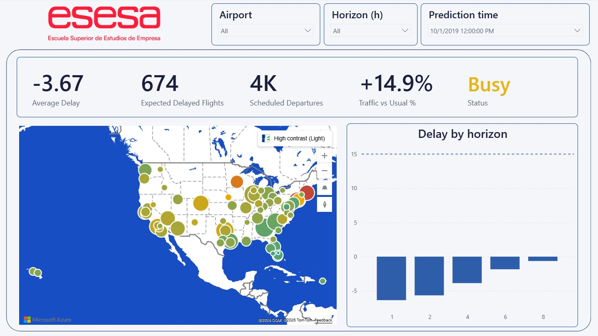
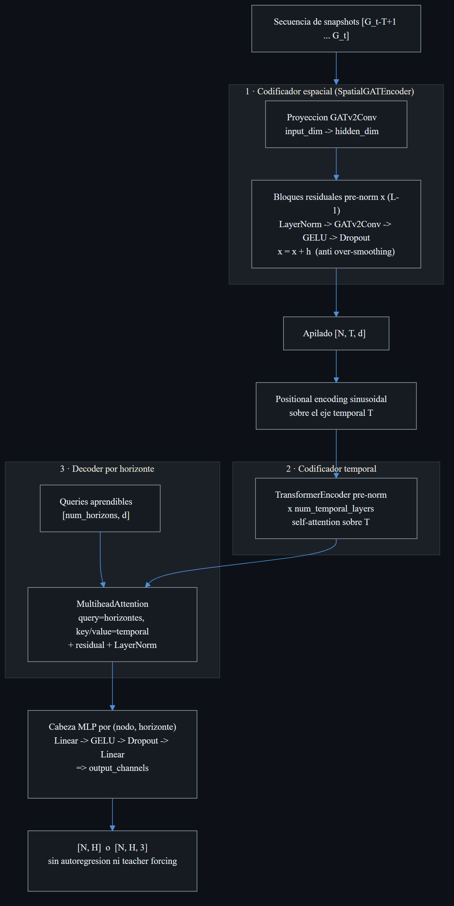
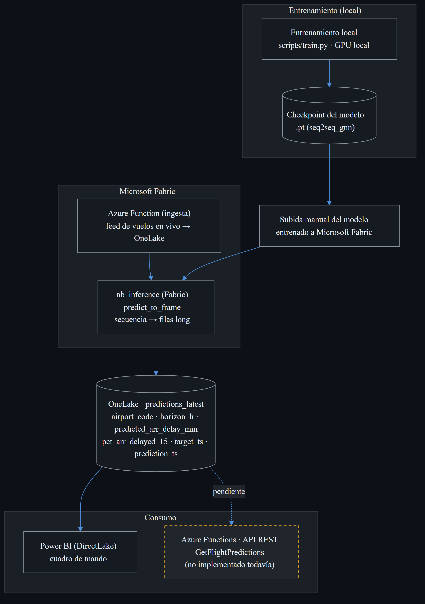
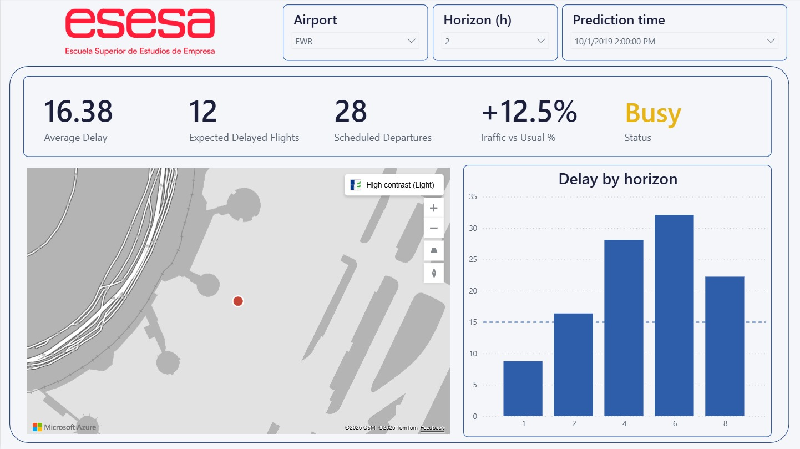

# Flight Delay Propagation Prediction

> Predicting how flight delays ripple across the U.S. airport network with a spatio-temporal Transformer — trained locally, deployed end-to-end on Azure + Microsoft Fabric, and served live to a Power BI dashboard.


**Master's Thesis · ESESA** — Author: **Gonzalo López Crespo**

<p align="center">
  
  <br>
  <em>Live dashboard — hourly delay predictions for the 70 busiest U.S. airports, up to 8 hours ahead, served from Microsoft Fabric via Power BI DirectLake.</em>
</p>

## Overview

This project models the U.S. airport network as a graph: the 70 busiest airports are nodes and flight routes are directed edges. Hourly graph snapshots (traffic, delay, and weather features per airport) feed a sequence of progressively complex architectures — from dense baselines to the final spatio-temporal Transformer — that predict the average arrival delay at every airport **1, 2, 4, 6 and 8 hours ahead**.

The key question: *"If Atlanta has a 45-minute delay right now, when does that delay reach Chicago, Dallas, and Los Angeles?"*

Exogenous weather features come from the [Open-Meteo Historical Weather API](https://open-meteo.com/) (ERA5 reanalysis): wind speed/gusts, precipitation, cloud cover, and a bucketed WMO weather category per airport-hour ([src/data/weather.py](src/data/weather.py)).

<p align="center">
  
  <br>
  <em>End-to-end pipeline: BTS flights + Open-Meteo weather → preprocessing → graph snapshots → multi-horizon GNN → OneLake → Power BI.</em>
</p>

## Models

| Model | Type | Description |
|-------|------|-------------|
| DenseNN | Baseline | Fully connected network on tabular features |
| LSTM | Baseline | Sequence model for temporal delay patterns |
| BasicGCN | GNN | Graph Convolutional Network on airport graph |
| MultiHorizonGAT | GNN | Graph Attention Network with multi-step prediction |
| SpatioTemporalGNN | GNN + LSTM | Earlier spatio-temporal iteration |
| **Seq2SeqGNN** | **Spatio-temporal Transformer** | **Final model (main contribution)** |

### Final architecture

Despite the class name (kept as `Seq2SeqGNN` for config and checkpoint compatibility), the final model is a spatio-temporal Transformer ([src/models/seq2seq_gnn.py](src/models/seq2seq_gnn.py)):

1. **Spatial encoder** — three stacked `GATv2Conv` layers with pre-norm residuals, `LayerNorm` and `GELU`, consuming 5-channel edge features (scheduled flights, recent route delay, …).
2. **Temporal encoder** — per-snapshot node embeddings over a 6-hour input window, with sinusoidal positional encoding, processed by a 2-layer pre-norm Transformer encoder.
3. **Horizon-query decoder** — one learnable query per prediction horizon cross-attends to the temporal sequence; no autoregression, so an early miss does not cascade into longer horizons.

<p align="center">
  
  <br>
  <em>Spatial GATv2 encoder → sinusoidal positional encoding → temporal Transformer encoder → horizon-query cross-attention decoder → per-(airport, horizon) MLP head.</em>
</p>

## Results

Champion model on the held-out temporal test split (trained on 2018–2019, evaluated on later unseen data), averaged across all five horizons:

| Model | Config | MAE (min) | RMSE (min) |
|-------|--------|-----------|------------|
| **Seq2SeqGNN** (Transformer, large) | `configs/weekend/seq2seq_gnn_large.yaml` | **10.02** | 18.26 |

The large variant (hidden_dim 256, 8 attention heads) predicts each airport's average arrival delay to within **~10 minutes** more than an hour ahead, for the entire 70-airport network at once. It is the exact checkpoint deployed to the live system shown above. Per-horizon breakdowns — accuracy degrades gracefully as the horizon lengthens — and the full baseline ladder (DenseNN → LSTM → GCN → GAT → Transformer) are documented in the thesis.

## Deployment

The model is deployed as a live demo system on Azure + Microsoft Fabric (see [docs/deployment-plan.md](docs/deployment-plan.md) for the full architecture):

- **Ingestion** — an Azure Function (`azure_functions/flight_data_api`) serves flight data into a Fabric Lakehouse rolling buffer, triggered hourly by a Fabric Data Factory pipeline.
- **Inference** — a Fabric notebook (`fabric/notebooks/nb_inference.ipynb`) runs the champion checkpoint hourly, writing 70 airports × 5 horizons = 350 predictions per run to Delta tables (`predictions_latest`, `predictions_history`).
- **Serving** — a second Azure Function (`azure_functions/predictions_api`) exposes predictions over HTTP.
- **Dashboard** — a Power BI report (`powerbi/`, spec in [docs/powerbi-report-spec.md](docs/powerbi-report-spec.md)) visualizes live predictions and model accuracy.
- **Retraining** — a monthly champion/challenger pipeline is designed as code-as-documentation (`aml/`) but intentionally not enabled for the demo scope.

<p align="center">
  
  <br>
  <em>Local training → checkpoint upload → Fabric ingestion + hourly inference → OneLake Delta tables → Power BI DirectLake.</em>
</p>

The dashboard drills down to any single airport and horizon:

<p align="center">
  
  <br>
  <em>Drilldown — Newark (EWR), 2 hours ahead: predicted delay and how it builds across horizons.</em>
</p>

## Project Structure

```
├── aml/                  # AzureML retraining pipeline (code-as-documentation)
├── azure_functions/      # Ingestion + predictions HTTP APIs
├── configs/              # Hyperparameter configurations (YAML)
├── data/
│   ├── raw/              # Original Kaggle CSVs/Parquet (not tracked)
│   └── processed/        # Cleaned data + snapshot/weather caches (not tracked)
├── deploy/               # Azure provisioning scripts
├── docs/                 # Deployment plan, Power BI spec, next steps
├── fabric/               # Fabric notebooks + Data Factory pipeline blueprints
├── notebooks/            # Jupyter notebooks for EDA and results
├── powerbi/              # Power BI report assets
├── scripts/              # Entry points (train, evaluate, predict, export)
├── src/
│   ├── data/             # Loading, preprocessing, graph builder, weather
│   ├── models/           # Neural network architectures
│   ├── training/         # Training loop, callbacks, losses
│   ├── evaluation/       # Metrics, reporting, visualization
│   ├── inference/        # Batch predictor used by the Fabric pipeline
│   └── utils/            # Config, logging, reproducibility, I/O
└── tests/                # Unit tests
```

## Setup

### Prerequisites

- Python 3.10+
- [uv](https://docs.astral.sh/uv/)
- CUDA-compatible GPU (recommended, not required)

### Installation

```bash
git clone https://github.com/gonzalonao/flight-delay-propagation.git
cd flight-delay-propagation

# Install all dependencies from the lockfile (PyTorch cu128 wheels are
# resolved automatically via the index configured in pyproject.toml)
uv sync

# With dev tools (pytest, ruff, jupyter)
uv sync --extra dev

# With Azure deployment dependencies
uv sync --extra deploy
```

### Data

Download the dataset from Kaggle ([Flight Delay Dataset 2018-2022](https://www.kaggle.com/datasets/robikscube/flight-delay-dataset-20182022)):

```bash
uvx kaggle datasets download -d robikscube/flight-delay-dataset-20182022 -p data/raw/ --unzip
```

See [`data/README.md`](data/README.md) for detailed instructions.

## Usage

```bash
# Train a model
uv run python scripts/train.py --config configs/weekend/seq2seq_gnn_large.yaml

# Evaluate a trained model
uv run python scripts/evaluate.py --checkpoint outputs/best_model.pt

# Batch inference (same code path as the Fabric pipeline)
uv run python scripts/predict.py --checkpoint outputs/best_model.pt

# Export tables for the Power BI report
uv run python scripts/export_powerbi.py
```

## License

MIT — see [LICENSE](LICENSE) for details.
