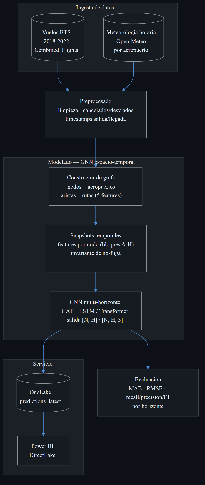
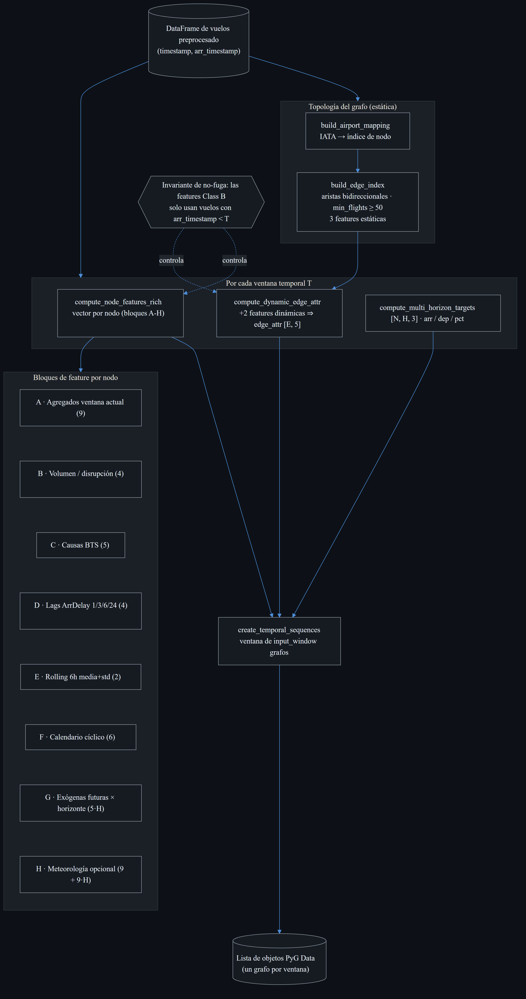
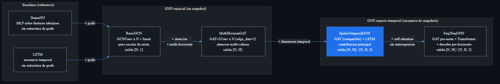
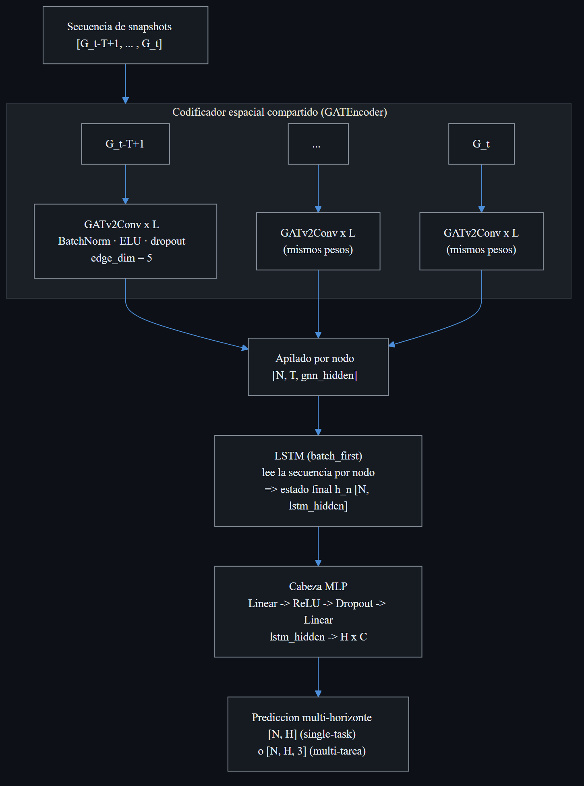
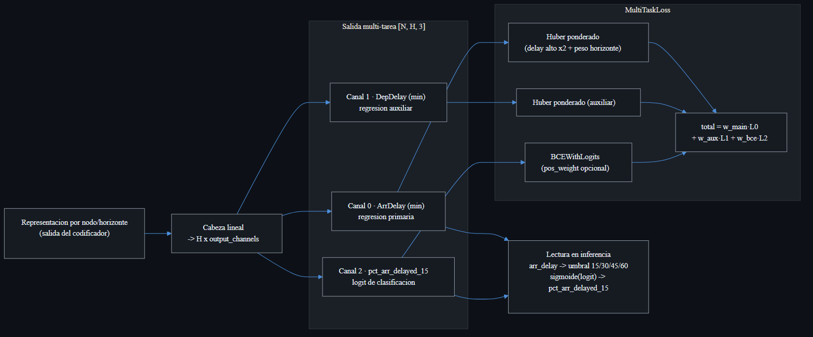
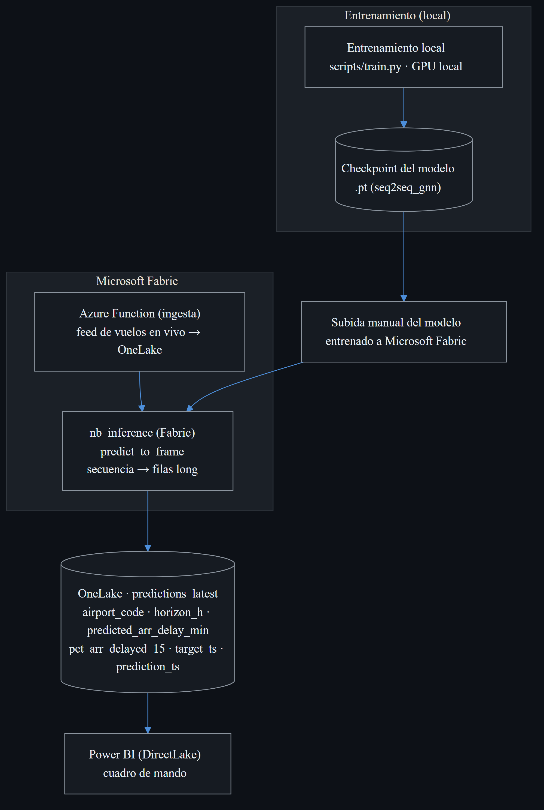

# Diagramas y fragmentos de código para la memoria del TFM

> Material gráfico y de código preparado para la memoria final del Trabajo Fin
> de Máster (*Predicción de la propagación de retrasos aéreos mediante redes
> neuronales de grafos espacio-temporales*).
>
> - Los diagramas se generan con **Mermaid** y están renderizados a PNG en
>   [`docs/diagrams/png/`](diagrams/png/). El código fuente editable de cada uno
>   está en [`docs/diagrams/`](diagrams/) (`*.mmd`) y se reproduce bajo cada
>   figura por si hay que ajustar etiquetas antes de maquetar.
> - Para re-renderizar tras un cambio:
>   `npx -p @mermaid-js/mermaid-cli mmdc -i docs/diagrams/<archivo>.mmd -o docs/diagrams/png/<archivo>.png -b "#0d1117" -s 3`
> - Todos comparten una directiva `%%{init}%%` con la misma paleta oscura para
>   mantener un estilo homogéneo en toda la memoria.
> - **Alcance del sistema.** La memoria describe el sistema implementado: la vía
>   **GNN espacio-temporal**. La línea exploratoria de un modelo per-vuelo
>   (gradient boosting / LightGBM) no se implementó como parte del sistema; su
>   material gráfico se conserva archivado en
>   [`docs/diagrams/LightGBM/`](diagrams/LightGBM/) por si se retoma en el futuro.

---

## 1. Diagramas

### Figura 1 — Flujo de trabajo de extremo a extremo

Visión global del sistema: ingesta de datos (vuelos BTS 2018–2022 y meteorología
horaria de Open-Meteo), preprocesado, modelado con la **GNN espacio-temporal**
multi-horizonte, evaluación y servicio en producción.



Fuente: [`docs/diagrams/01_pipeline_general.mmd`](diagrams/01_pipeline_general.mmd).

---

### Figura 2 — Construcción del grafo aeropuerto-hora

Detalle de `src/data/graph_builder.py`: topología estática (nodos = aeropuertos,
aristas bidireccionales de rutas con tres *features* estáticas) y, por cada
ventana temporal `T`, el vector de *features* por nodo organizado en bloques
A–H, las dos *features* dinámicas de arista (que completan `edge_attr [E, 5]`) y
los *targets* multi-horizonte multi-canal `[N, H, 3]`. La **invariante de
no-fuga temporal** condiciona todo el cálculo *Class B*.



Fuente: [`docs/diagrams/02_construccion_grafo.mmd`](diagrams/02_construccion_grafo.mmd).

---

### Figura 3 — Familia de modelos (complejidad creciente)

Progresión metodológica del proyecto: de los *baselines* sin estructura de grafo
(DenseNN, LSTM) a la GNN espacial de un *snapshot* (BasicGCN → MultiHorizonGAT)
y, finalmente, a los modelos espacio-temporales que procesan **secuencias** de
*snapshots* (SpatioTemporalGNN, contribución principal; y Seq2SeqGNN, el
rediseño Transformer).



Fuente: [`docs/diagrams/03_familia_modelos_gnn.mmd`](diagrams/03_familia_modelos_gnn.mmd).

---

### Figura 4 — SpatioTemporalGNN (contribución principal)

Arquitectura de `src/models/spatiotemporal_gnn.py`: un `GATEncoder` **compartido**
extrae el *embedding* espacial de cada *snapshot*; la secuencia por nodo se apila
en `[N, T, gnn_hidden]` y la lee un `LSTM`; el estado final alimenta una cabeza
MLP que emite la predicción multi-horizonte.



Fuente: [`docs/diagrams/04_spatiotemporal_gnn.mmd`](diagrams/04_spatiotemporal_gnn.mmd).

---

### Figura 5 — Seq2SeqGNN: Transformer espacio-temporal

Rediseño de `src/models/seq2seq_gnn.py` (el nombre de clase y la ruta se
conservan por compatibilidad de *configs*/*checkpoints*). Tres etapas:
(1) codificador espacial GAT con residuales *pre-norm*; (2) codificador temporal
*Transformer* con *positional encoding*; (3) decoder de *queries* por horizonte
con *cross-attention*. **Sin autoregresión ni *teacher forcing***, lo que evita
la propagación de error a horizontes largos.


Fuente: [`docs/diagrams/05_transformer_seq2seq.mmd`](diagrams/05_transformer_seq2seq.mmd).

---

### Figura 6 — Cabeza multi-tarea y función de pérdida

La cabeza emite `[N, H, 3]` con tres canales (ArrDelay, DepDelay auxiliar y el
*logit* de `pct_arr_delayed_15`). `MultiTaskLoss` combina dos *Huber* ponderados
y una `BCEWithLogits`. La clasificación de "vuelo retrasado" se **deriva en
inferencia** de la regresión por umbral, no se reentrena.



Fuente: [`docs/diagrams/06_cabeza_multitarea.mmd`](diagrams/06_cabeza_multitarea.mmd).

---

### Figura 7 — Servicio y despliegue (estado actual)

Arquitectura operativa implementada: el modelo se **entrena localmente** y su
*checkpoint* se **sube manualmente a Microsoft Fabric**. La **ingesta** del feed
de vuelos en vivo la realiza una **Azure Function**; el cuaderno de inferencia de
Fabric (`predict_to_frame`) escribe la tabla canónica `predictions_latest` en
OneLake, que consume Power BI mediante DirectLake.



Fuente: [`docs/diagrams/09a_servicio_actual.mmd`](diagrams/09a_servicio_actual.mmd).

---

### Figura 8 — Servicio y despliegue (con consumo por API, previsto)

Variante que incorpora el **consumo por API REST** (Azure Functions,
`GetFlightPredictions`) leyendo de `predictions_latest`. Se representa como línea
prevista (**no implementado todavía**); el resto de la arquitectura es idéntica a
la Figura 7.


Fuente: [`docs/diagrams/09b_servicio_con_api.mmd`](diagrams/09b_servicio_con_api.mmd).

---

## 2. Fragmentos de código clave

> Selección de extractos representativos de `src/` para ilustrar en la memoria
> las decisiones de diseño no triviales. Se indica el archivo y las líneas de
> origen; los extractos pueden recortarse para maquetar.

### 2.1 Invariante de no-fuga temporal en el constructor del grafo

El riesgo metodológico central de un modelo de propagación es filtrar el futuro.
El *docstring* del módulo formaliza qué columnas pueden depender del instante `T`
y, en el cálculo de *features*, los datos *Class B* (post-hoc) se restringen a
vuelos ya aterrizados.

`src/data/graph_builder.py` (líneas 8–25, docstring del módulo):

```python
INVARIANTE DE FUGA TEMPORAL (no leakage)
-----------------------------------------
En el snapshot con `current_end = T`, las features y aristas de cada
nodo solo pueden depender de:
  * Cualquier vuelo con `arr_timestamp < T` (completado antes de T).
  * Las columnas de schedule (`CRS*`, `Distance`, `Airline`, `Origin`,
    `Dest`) de cualquier vuelo — son conocidas a priori ...
NO pueden depender de columnas Class B (post-hoc: `DepTime`, `ArrTime`,
`WheelsOff/On`, ... `ArrDelay`, ...) de vuelos cuyo `arr_timestamp >= T`.
```

`src/data/graph_builder.py` (líneas 782–788, aplicación de la invariante):

```python
# Class B (post-hoc) features solo pueden derivarse de vuelos cuyo
# arr_timestamp < current_end (i.e., el vuelo ha aterrizado antes de T).
if "arr_timestamp" in window_df.columns and not window_df.empty:
    completed_df = window_df[window_df["arr_timestamp"] < current_end]
else:
    completed_df = window_df
```

### 2.2 Codificador espacio-temporal: GAT compartido + LSTM

El *forward* de la contribución principal: el mismo `GATEncoder` codifica cada
*snapshot*, se apila la secuencia por nodo y el `LSTM` resume la dinámica
temporal antes de la cabeza multi-horizonte.

`src/models/spatiotemporal_gnn.py` (líneas 229–256):

```python
def forward(self, sequence: list[Data]) -> torch.Tensor:
    embeddings = []
    for graph in sequence:
        emb = self.encoder(graph.x, graph.edge_index, graph.edge_attr)
        embeddings.append(emb)

    # Stack: list of [N, gnn_hidden] -> [N, T, gnn_hidden]
    stacked = torch.stack(embeddings, dim=1)

    # LSTM: [N, T, gnn_hidden] -> h_n [1, N, lstm_hidden]
    _, (h_n, _) = self.lstm(stacked)

    out = self.head(h_n.squeeze(0))
    if self.output_channels == 1:
        return out  # [N, H] — legacy
    return out.view(out.size(0), self.num_horizons, self.output_channels)
```

### 2.3 Decoder de *queries* por horizonte (Transformer)

El rediseño Transformer sustituye el LSTM por *self-attention* temporal y un
decoder donde cada horizonte es una *query* aprendible que atiende a la secuencia
del nodo. Esto elimina la autoregresión y, con ella, la cascada de error a
horizontes largos.

`src/models/seq2seq_gnn.py` (líneas 324–357):

```python
# 1) Per-snapshot spatial encoding.
embeddings = [
    self.spatial_encoder(g.x, g.edge_index, g.edge_attr) for g in sequence
]
spatial = torch.stack(embeddings, dim=1)          # [N, T, d]

# 2) Positional encoding + Transformer encoder over the T axis.
spatial = self.positional_encoding(spatial)
temporal = self.temporal_encoder(spatial)         # [N, T, d]

# 3) Horizon-query cross-attention.
queries = self.horizon_queries.unsqueeze(0).expand(temporal.shape[0], -1, -1)
attended, _ = self.cross_attention(
    query=queries, key=temporal, value=temporal, need_weights=False,
)
attended = self.cross_attn_norm(attended + queries)

# 4) Per-horizon MLP head.
out = self.head(attended)                         # [N, H, output_channels]
return out.squeeze(-1) if self.output_channels == 1 else out
```

### 2.4 Pérdida multi-tarea

Combinación de las tres tareas con ponderación por horizonte y por retraso alto.
El umbral de retraso se aplica solo a las regresiones; la clasificación usa
`BCEWithLogits` con `pos_weight` opcional para el desbalanceo.

`src/training/losses.py` (líneas 281–301):

```python
arr_loss = self._weighted_huber(
    predictions[..., TARGET_CHANNEL_ARR_DELAY],
    targets[..., TARGET_CHANNEL_ARR_DELAY],
)
dep_loss = self._weighted_huber(
    predictions[..., TARGET_CHANNEL_DEP_DELAY],
    targets[..., TARGET_CHANNEL_DEP_DELAY],
)
bce_loss = self._weighted_bce(
    predictions[..., TARGET_CHANNEL_PCT_DELAYED],
    targets[..., TARGET_CHANNEL_PCT_DELAYED].clamp(0.0, 1.0),
)
total = (
    self.main_weight * arr_loss
    + self.aux_weight * dep_loss
    + self.bce_weight * bce_loss
)
```

---

*Documento generado para la memoria del TFM. Los números de línea corresponden
al estado del repositorio en la rama `explore/flight-level-signal`. El material
de la línea exploratoria per-vuelo (no implementada) se archiva en
[`docs/diagrams/LightGBM/`](diagrams/LightGBM/).*
